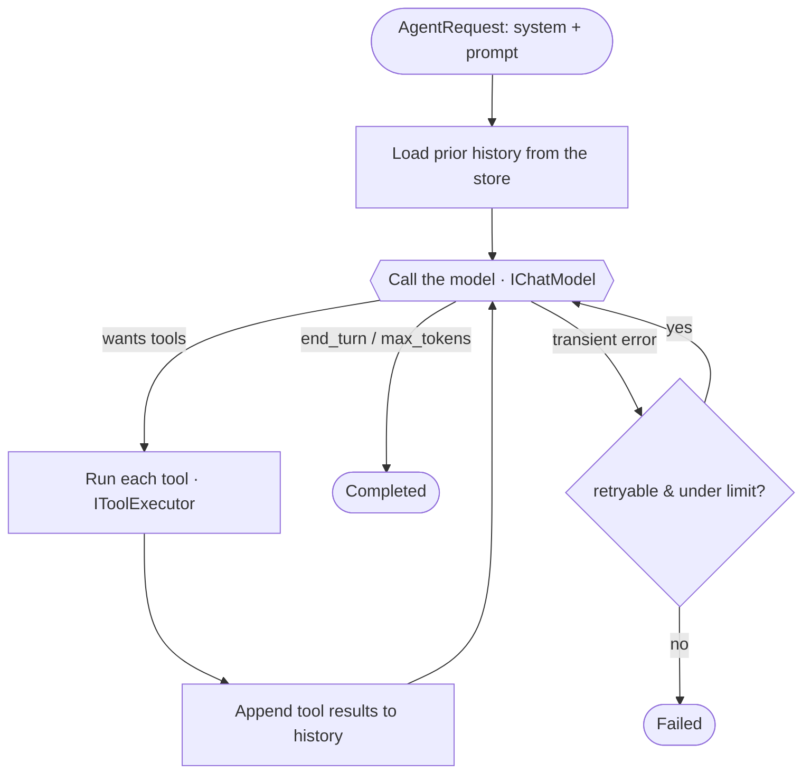

<h1 align="center">Agentry</h1>

<p align="center">
  <b>A lightweight, provider-agnostic agentic tool-use loop for .NET.</b><br/>
  You define the tools. Agentry runs the model ↔ tool conversation.
</p>

<p align="center">
  
  
  
  
</p>

---

Give a language model a set of typed C# tools and a goal, and Agentry runs the loop that lets it
get there: call the model, run the tools it asks for, feed the results back, repeat until it's done.
You write the tools and pick a model — Agentry owns the loop, the tool protocol, JSON-schema
generation, streaming progress, and crash-resume.

```csharp
var runner = new AgentRunner<MyState>(model, executor, new InMemoryConversationStore());
var result = await runner.RunToCompletionAsync(
    new AgentRequest { System = "You manage a news database.", Prompt = "Improve the SEO of article 1" },
    new MyState());

Console.WriteLine(result.Text);          // the agent's final answer
Console.WriteLine(result.Usage.Total);   // tokens spent across the whole run
```

- [Why Agentry / origin](#why-agentry) · [How the loop works](#how-the-loop-works) · [Core concepts](#core-concepts)
- [Install](#install) · [Quickstart](#quickstart) · [Streaming vs. one-shot](#two-ways-to-run)
- [Providers](#providers) · [Persistence & resume](#persistence--resume) · [Samples](#samples)
- [Compared to Microsoft Agent Framework](#compared-to-microsoft-agent-framework) · [Roadmap](#roadmap) · [Contributing](#contributing)

## Why Agentry

Agentry is a **clean-room reimplementation** of an agentic engine I built (72 tools, an autonomous
tool-use loop, streaming, crash-resume) to power a multi-tenant SaaS — *before*
[Microsoft Agent Framework](https://github.com/microsoft/agent-framework) existed. The original is
proprietary and welded to a private platform; Agentry is the generalized, dependency-light version,
open-sourced as a **reference implementation** of how an agentic tool-use loop actually works under
the hood. See **[docs/ORIGIN.md](docs/ORIGIN.md)** for sanitized excerpts of the original and exactly
how Agentry differs.

> **Building production agents today?** Look at Microsoft Agent Framework first — it's the GA,
> Microsoft-backed standard. Agentry is intentionally tiny: a great way to *understand* the machinery,
> or to drop a minimal agent into an app without taking on a heavyweight platform. See the
> [comparison](#compared-to-microsoft-agent-framework).

## How the loop works

An "agent" is just this loop. The model decides what to do; your tools do it; the results go back to
the model; repeat until it ends its turn.



Every step is surfaced as an [`AgentEvent`](#core-concepts) you can stream to a UI, an SSE endpoint, or
a log. Every turn is persisted, so a run can resume after a crash. A hard `MaxIterations` cap keeps a
runaway agent from looping forever.

## Core concepts

Six small pieces. Learn these and you know the whole library.

| Concept | Type | What it is |
|---|---|---|
| **Tool** | `ITool<TContext>` / `Tool<TInput,TContext>` | A capability the model can call. Its JSON schema is generated from your C# input type. |
| **Context** | `TContext` (yours) | Per-run state threaded through every tool call — ids you created, the current user, a DB factory. |
| **Model** | `IChatModel` | The provider seam. Swap models without touching the loop. Anthropic adapter included. |
| **Store** | `IConversationStore` | Where turns are persisted so a run can resume. In-memory by default; bring your own. |
| **Runner** | `IAgentRunner<TContext>` | Runs the loop. Stream events with `RunAsync`, or get a final result with `RunToCompletionAsync`. |
| **Event** | `AgentEvent` | A progress notification: `Started`, `AssistantText`, `ToolStarted`, `ToolFinished`, `UsageUpdated`, `Completed`, `Failed`. |

Full mental model in **[docs/concepts.md](docs/concepts.md)**.

## Install

The packages aren't on NuGet yet. Use Agentry today by referencing the projects (clone, then add a
`<ProjectReference>` to `Agentry.Core` and a provider like `Agentry.Anthropic`), or build the packages
locally with `dotnet pack -c Release`. CI publishes to NuGet automatically on a `v*` tag once a feed is
configured.

| Package | Purpose | Depends on |
|---|---|---|
| `Agentry.Abstractions` | Contracts: tools, model seam, messages, events, store | nothing |
| `Agentry.Core` | The loop engine, tool executor, schema generation, DI | `Agentry.Abstractions` |
| `Agentry.Anthropic` | `IChatModel` over the Anthropic Messages API | `Agentry.Abstractions` |

`Agentry.Core` has **zero required third-party dependencies** (the `Microsoft.Extensions.*` packages it
references ship with the runtime). Targets `net8.0` and `net10.0`.

## Quickstart

```csharp
using System.ComponentModel;
using Agentry;
using Microsoft.Extensions.DependencyInjection;

// 1 — Your per-run state, threaded through every tool call.
public sealed class MyContext { public List<long> CreatedIds { get; } = []; }

// 2 — A tool. The JSON schema is generated from the Input type; [Description] enriches it.
public sealed class CreateUserTool(IUserService users) : Tool<CreateUserTool.Input, MyContext>
{
    public override string Name => "create_user";
    public override string Description => "Creates a user account and returns its id.";

    protected override async Task<ToolResult> ExecuteAsync(Input input, MyContext ctx, ToolCall call, CancellationToken ct)
    {
        var id = await users.CreateAsync(input.Email, ct);
        ctx.CreatedIds.Add(id);
        return ToolResult.Ok(call, $"Created user {id}.", new { id });   // text the model sees + optional data for you
    }

    public sealed class Input
    {
        [Description("Email address of the new user")] public string Email { get; set; } = "";
    }
}

// 3 — Register the engine, your tools, and a model provider.
services.AddAgentry<MyContext>(a => a.AddTool<CreateUserTool>());
services.AddAnthropicChatModel(o => o.ApiKey = config["Anthropic:Key"]!);

// 4 — Run it.
var runner = provider.GetRequiredService<IAgentRunner<MyContext>>();
var result = await runner.RunToCompletionAsync(
    new AgentRequest { System = "You are a helpful admin assistant.", Prompt = "Create a user for jane@acme.com" },
    new MyContext());

Console.WriteLine(result.Text);
```

Want it running in 20 seconds with **no API key**? See
**[samples/MinimalAgent](samples/MinimalAgent)** — one tool, a tiny offline model, `dotnet run`.

## Two ways to run

**One-shot** — when you just want the answer:

```csharp
AgentResult result = await runner.RunToCompletionAsync(request, state);
// result.Text, result.Usage, result.StopReason, result.IsSuccess, result.RunId
```

**Streaming** — when you want to show progress (a UI, an SSE endpoint, logs):

```csharp
await foreach (AgentEvent ev in runner.RunAsync(request, state, ct))
{
    switch (ev)
    {
        case AgentEvent.AssistantText t: Console.WriteLine(t.Text); break;
        case AgentEvent.ToolStarted s:   Console.WriteLine($"… {s.ToolName}"); break;
        case AgentEvent.ToolFinished f:  Console.WriteLine($"✓ {f.ToolName} ({f.Success})"); break;
        case AgentEvent.UsageUpdated u:  Console.WriteLine($"tokens: {u.Cumulative.Total}"); break;
        case AgentEvent.Completed c:     Console.WriteLine($"done: {c.Reason}"); break;
        case AgentEvent.Failed e:        Console.WriteLine($"error: {e.Error}"); break;
    }
}
```

Both run the same loop — `RunToCompletionAsync` just consumes the stream for you.

## Providers

The loop talks to `IChatModel`, never to a vendor wire format. **Agentry.Anthropic** is included
(a dependency-free adapter over the Messages API, using `IHttpClientFactory`):

```csharp
services.AddAnthropicChatModel(o =>
{
    o.ApiKey = config["Anthropic:Key"]!;   // required — throws early if missing
    o.Model  = "claude-haiku-4-5";          // model ids change over time; set one explicitly
});
```

To support any other backend (OpenAI, Azure OpenAI, Ollama, a gateway, a fake for tests), implement
`IChatModel` — one method that maps messages + tools to your API and back. Mark transient failures
(`429`, `5xx`, network blips) with `IsRetryable = true` and the loop retries them with backoff;
everything else fails fast. Guide: **[docs/providers.md](docs/providers.md)**.

## Persistence & resume

Every turn is appended to an `IConversationStore`. Re-run with the same `RunId` and the loop loads the
prior history and continues — so an agent survives a process restart mid-run.

```csharp
// default: in-memory (great for tests, single-process, request-scoped runs)
services.AddAgentry<MyContext>(...);   // registers InMemoryConversationStore

// production: bring your own (EF Core, Redis, Mongo, ...) — implement two methods
services.AddSingleton<IConversationStore, EfConversationStore>();
```

Resume semantics + a complete EF Core store example: **[docs/persistence.md](docs/persistence.md)**.

## Samples

Runnable, copy-paste console apps in [`samples/`](samples) — the first two run **offline, no API key**:

| Sample | Shows | API key? |
|---|---|---|
| [**MinimalAgent**](samples/MinimalAgent) | The smallest possible agent — one tool, no DI, offline model | No |
| [**PersistenceResume**](samples/PersistenceResume) | Persist a conversation and resume it after a "restart" | No |
| [**Agentry.Sample**](samples/Agentry.Sample) | Tools + streaming progress events; offline, or live via Anthropic | Optional |
| [**FileQaAgent**](samples/FileQaAgent) | A real app: chat with a folder of files using real file tools + a real LLM | Yes |
| [**NewsAgent**](samples/NewsAgent) | A real DB-backed app: create / list / update / improve-SEO / delete news via EF Core SQLite + a real LLM | Yes |

```bash
dotnet run --project samples/MinimalAgent          # offline, instant
dotnet run --project samples/PersistenceResume     # offline, proves resume
ANTHROPIC_API_KEY=sk-ant-... dotnet run --project samples/NewsAgent
```

## Compared to Microsoft Agent Framework

Both run an agentic tool-use loop. They aim at different things.

| | Agentry | Microsoft Agent Framework |
|---|---|---|
| Goal | Understand the machinery; minimal embed | Production agent platform |
| Size | ~1k lines, 3 packages | Large, many packages |
| Dependencies | Zero required (Core) | Built on `Microsoft.Extensions.AI` + more |
| Providers | `IChatModel` seam; Anthropic included | Broad, via `Microsoft.Extensions.AI` |
| Multi-agent, workflows, MCP, telemetry | Out of scope | Built in |
| Status | Reference implementation | GA, Microsoft-backed |

**Use MAF** for production multi-agent systems. **Read or use Agentry** when you want to see exactly how
the loop works, or want a tiny dependency-free engine you can fully hold in your head.

## Roadmap

Agentry is a focused reference implementation, not a platform. Likely additions, in keeping with that:

- An OpenAI / `Microsoft.Extensions.AI` provider adapter (second provider proves the seam).
- A ready-made EF Core `IConversationStore` package.
- Streaming token deltas through `AgentEvent`.

Non-goals: multi-agent orchestration, a workflow engine, a plugin marketplace — that's what MAF is for.

## Contributing

Issues and PRs welcome. The whole engine is small and readable on purpose — start at
[`AgentRunner.cs`](src/Agentry.Core/AgentRunner.cs) (the loop) and
[`ToolSchema.cs`](src/Agentry.Core/ToolSchema.cs) (schema generation). `dotnet test Agentry.slnx`
runs the suite; please keep new behavior covered.

## License

[MIT](LICENSE). Use it, learn from it, ship it.
