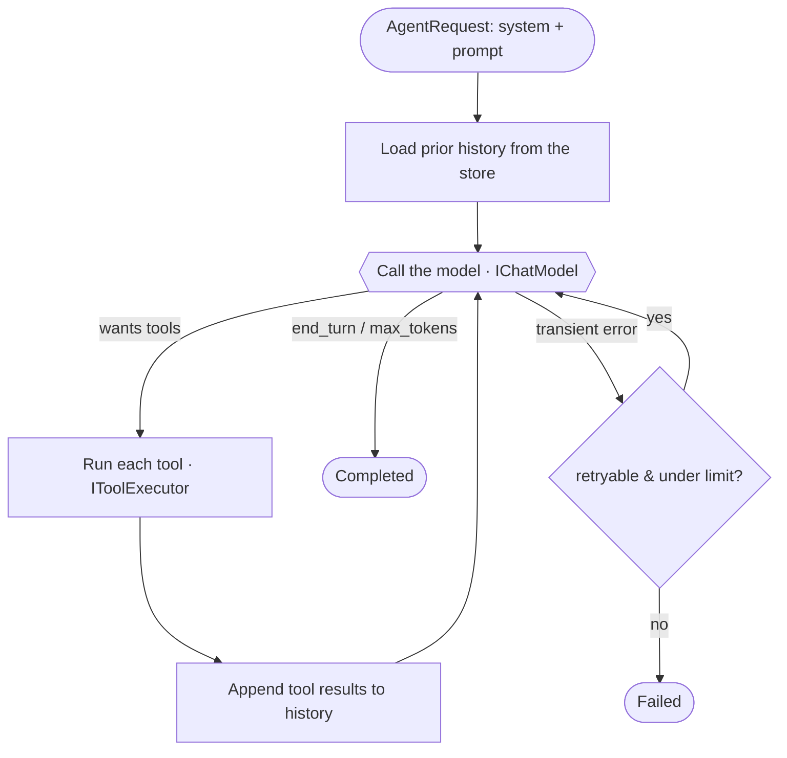

# Concepts

Agentry is small. This page is the whole mental model — once it clicks, the API is obvious.

## The loop

An "agent" is one loop: ask the model what to do, do it, tell the model what happened, repeat until
the model says it's finished.



That's it. `AgentRunner<TContext>` implements exactly this. Everything else is the types that flow
through it.

## The six pieces

| Piece | Type | Role |
|---|---|---|
| Tool | `ITool<TContext>` / `Tool<TInput,TContext>` | A capability the model can invoke. |
| Context | `TContext` (you define it) | Per-run state, threaded through every tool call. |
| Model | `IChatModel` | The provider. The loop talks only to this. |
| Store | `IConversationStore` | Persists turns so a run can resume. |
| Runner | `IAgentRunner<TContext>` | Drives the loop; emits events. |
| Event | `AgentEvent` | A progress notification for the host. |

### Tool

A unit of work the model can ask for. You give it a `Name`, a `Description` (the model reads this to
decide *when* to call it), and an `InputSchema` (JSON Schema describing its arguments). Deriving from
`Tool<TInput,TContext>` generates the schema from your C# type and deserializes arguments for you. See
**[writing-a-tool.md](writing-a-tool.md)**.

### Context (`TContext`)

Your own class. It's created once per run and passed to every tool call, so tools can share state
within a run without globals — e.g. the ids you've created so far, the current tenant/user, or a
factory for a database connection. Agentry never inspects it; it's yours.

```csharp
public sealed class MyContext
{
    public required Func<MyDbContext> NewDb { get; init; }
    public List<long> CreatedIds { get; } = [];
}
```

### Model (`IChatModel`)

One method: `CompleteAsync(ModelRequest) → ModelResponse`. The loop hands it the conversation plus the
tool definitions and gets back one turn: some text, some tool calls, a `StopReason`, and token usage.
Implement it per provider. **[providers.md](providers.md)**.

### Store (`IConversationStore`)

Two methods: `AppendAsync` and `LoadAsync`. The loop appends each new turn as it happens and loads
history at the start of a run. The default is in-memory; swap in EF Core / Redis / Mongo for durable
resume. **[persistence.md](persistence.md)**.

### Runner (`IAgentRunner<TContext>`)

Runs the loop. Two ways to consume it:

```csharp
// stream progress
await foreach (AgentEvent ev in runner.RunAsync(request, state, ct)) { ... }

// or just get the final result
AgentResult result = await runner.RunToCompletionAsync(request, state, ct);
```

`RunToCompletionAsync` is an extension that consumes the stream and returns an `AgentResult`
(`RunId`, `Text`, `Usage`, `StopReason`, `Error`, `IsSuccess`).

### Event (`AgentEvent`)

A discriminated union (record hierarchy) of progress notifications:

| Event | When | Carries |
|---|---|---|
| `Started` | Run begins | `RunId` |
| `AssistantText` | Model produced text this turn | `Text` |
| `ToolStarted` | A tool is about to run | `CallId`, `ToolName` |
| `ToolFinished` | A tool finished | `CallId`, `ToolName`, `Success` |
| `UsageUpdated` | Token usage advanced | `Cumulative` (`TokenUsage`) |
| `Completed` | Run ended normally | `Reason` (`StopReason`), `TotalUsage` |
| `Failed` | Run ended with an error | `Error` |

Ignore the stream entirely and you've still got a working agent — the events are there when you want a
UI, an SSE feed, or logs.

## A turn, concretely

The conversation is a list of `AgentMessage`s, each with a `Role` (`System` / `User` / `Assistant` /
`Tool`). One "tool round" produces two messages:

1. An **assistant** message with one or more `ToolCall`s (`Id`, `Name`, raw JSON `Arguments`).
2. A **tool** message with the matching `ToolResult`s (`CallId`, `IsSuccess`, `Content`, optional `Data`).

The `CallId` correlates a result to its call. `ToolResult.Content` is the text the model sees next
turn; `ToolResult.Data` is optional structured data for *your* app and is not sent to the model.
Construct results with `ToolResult.Ok(call, text, data?)` or `ToolResult.Fail(call, error)` — **a
failure is fed back to the model, not thrown**, so the model can read the error and adapt.

## Stop reasons

A run ends with a `StopReason`:

| `StopReason` | Meaning |
|---|---|
| `EndTurn` | The model finished normally. The usual success case. |
| `ToolCalls` | The model wants tools — internal to the loop; you won't see a run *end* on this. |
| `MaxTokens` | The model's output was truncated at the token limit. |
| `MaxIterations` | The loop hit `AgentRequest.MaxIterations` before the model ended its turn (safety cap). |
| `Error` | The provider returned an unrecoverable error (surfaced as a `Failed` event). |

## Requests & options

`AgentRequest` is one run's input:

| Field | Default | Notes |
|---|---|---|
| `RunId` | new id | Set it to resume an existing conversation. |
| `System` | – | System prompt / instructions. |
| `Prompt` | – | The user message that starts (or continues) the run. Optional when resuming. |
| `Model` | provider default | Provider model id. |
| `MaxTokens` | 4096 | Max tokens per model call. |
| `MaxIterations` | 50 | Hard loop cap. Must be ≥ 1. |

`AgentryOptions` (passed to the runner / `Configure(...)` in DI) tunes resilience:

| Option | Default | Notes |
|---|---|---|
| `MaxRetries` | 3 | Consecutive transient-error retries before failing. |
| `RetryBaseDelayMs` | 1000 | Backoff base; doubles each retry (1s, 2s, 4s…), capped. |

Only errors the provider marks `IsRetryable = true` are retried; permanent errors fail fast.

## Resume

Persistence + `RunId` give you crash-resume for free. Start a run with `RunId = "abc"`; every turn is
appended to the store. If the process dies, start again with the same `RunId` — the loop loads the
prior history and continues where it left off. The contentless final turn is never persisted, so
resuming never replays an empty turn. See **[persistence.md](persistence.md)**.

## Cancellation & threading

`RunAsync` honors the `CancellationToken` between turns and during tool execution. Drain the stream
fully (or cancel) so the loop can finish persisting the current turn — abandoning a `RunAsync`
enumerator mid-iteration stops it at the next `yield`. `RunToCompletionAsync` drains for you.
